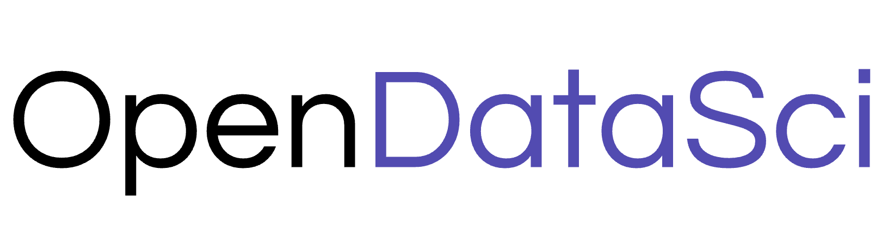

  

OpenDataSci is a secure AI agent specialized in data science and machine learning. It works autonomously: plans, codes, corrects itself, iterates, and accumulates knowledge about your data across sessions. A from-scratch run scored **top-30% among 3,000+ teams** in a live Kaggle competition, with **zero guidance**. OpenDataSci runs anywhere: It ships to run locally on your **Linux/macOS device** offering a Claude-Code-adjacent experience, it's **cloud-portable** (AWS, GCP, Azure), and is compatible with **self-hosted deployments** (any OpenAI-compatible server). 

  

---

## Contents

- [Benchmark](#benchmark)
- [What does OpenDataSci do?](#what-it-does)
- [Supported LLM providers](#supported-llm-providers)
- [Cloud portability](#cloud-portability)
- [Built-in ML library surface](#built-in-ml-library-surface)
- [Documentation](#documentation)
- [Setup](#setup)
- [Examples](#examples)
- [For Data Scientists](#for-data-scientists)

---

## Benchmark

**OpenDataSci v0.1.0 scored AUC 0.95069 -- Top-30% finish among 3k+ teams and 36k+ submissions.** ([Kaggle Playground Series S6E5](https://www.kaggle.com/competitions/playground-series-s6e5/leaderboard?tab=public&search=farouk+boukil))

The task was to predict whether an F1 driver will pit on the next lap. Pit stops are rare, making class imbalance a core challenge. The right call depends on dozens of interacting variables that require careful feature engineering and proper temporal handling.

The winner scored AUC 0.95503 across 195 submissions. That marginal gap relative to OpenDataSci's one-shot resolution cost a month of full-time work: a dozen model families, deep learning, notebooks with up to 400 hand-engineered features, AutoML sweeps across 4 libraries, AutoFE tools that either failed or timed out, and 186 out-of-fold models to ensemble. Claude was used throughout, yet repeatedly had to be talked out of giving up early and kept regenerating entire notebooks for marginal impact.

OpenDataSci needed one instruction: try to win the competition. Given only the zipped data, with no domain hints, prompt tuning, or human guidance, it explored the data, engineered features, tuned models, built diverse ensembles, and created a submission.

Find the winner's full writeup [here](https://www.kaggle.com/competitions/playground-series-s6e5/writeups/1st-place-by-the-skin-of-my-teeth).

---

## What does OpenDataSci do?

Most "AI for data" tools turn you into the bottleneck. Every experiment starts with re-explaining your data from scratch. Every output still needs a data scientist to verify. Every wrong turn costs a full cycle: prompt, wait, review, correct, repeat. And the moment you close the session, every insight and learned quirk of your dataset is gone.

**OpenDataSci is the expert you need.** It plans rigorously, executes, and catches its own mistakes before they reach you. When it goes in the wrong direction, it self-corrects. Every insight it uncovers is persisted and carried forward across sessions, so the next experiment starts smarter than the last. You set the goal. It does the work.

| | |
|--|--|
| **Near-zero config** | Point it at your data and go — a setup wizard walks you through provider/model choice on first run |
| **Full workflow** | EDA, cleaning, feature engineering, modelling, evaluation, visualisation, reporting |
| **Self-correcting** | Reviews and revises its own steps, and recovers from wrong turns without starting over |
| **Sandboxed execution** | Runs real Python safely inside your workspace |
| **Parallel agents** | Up to 3 concurrent subagents running parallel code executions — in the background, non-blocking |
| **Per-project knowledge accumulation** | Data schema, profiles, and notes carry over across sessions |
| **Skills** | Built-in skills (e.g., Data Science, Machine Learning) plus bring-your-own via Markdown files in `.opendatasci/skills/` |
| **Web search** | Look up papers, docs, and library changelogs mid-analysis |
| **MCP** | Connect internal tools, databases, and proprietary APIs |
| **Built-in TUI** | Use within your development environment (e.g., VSCode, Cursor) or from any terminal |
| **Human-in-the-loop** | Pauses at genuine decision forks, then gets on with it |

---

## Supported LLM providers

OpenDataSci supports every major cloud provider and fully self-hosted deployments. Use your existing infrastructure, stay within your compliance boundary, or keep costs low with a local model.

- Anthropic
- OpenAI
- AWS Bedrock
- Google Gemini (AI Studio)
- Google Vertex AI
- Azure OpenAI
- Ollama (local)
- OpenAI-compatible servers (e.g., vLLM server)

You can take it a step further and mix providers within a single session: one model for heavy reasoning, another for lightweight tasks like summarisation.

---

## Cloud portability

Every stateful dependency the agent relies on is built behind a swappable interface rather than tied to your local machine. The shipped implementations all run locally, but the architecture lets you replace any of them with a cloud-backed equivalent without touching the agent itself. See [Cloud Portability](libs/open-data-sci/README.md#cloud-portability) in the library README, including the full [table of dependencies and their recommended cloud implementations](libs/open-data-sci/README.md#dependencies-and-their-interfaces).

---

## Built-in ML library surface

No setup friction. OpenDataSci ships with the complete stack a practitioner would need.

| Domain | Libraries |
|--------|-----------|
| DataFrames | Polars, Pandas |
| Database connectivity | DuckDB |
| File formats | Excel/Parquet/Feather (via Pandas), XML (lxml) |
| Numerics | NumPy, SciPy |
| Classical ML | scikit-learn, LightGBM, CatBoost, XGBoost, statsmodels |
| Deep learning *(optional)* | PyTorch, JAX, Flax, Optax, Transformers, Sentence-Transformers |
| AutoML / tuning | Optuna |
| Forecasting | Prophet |
| Interpretability | SHAP |
| Anomaly detection | PyOD |
| Imbalanced data | imbalanced-learn |
| Dimensionality reduction | UMAP |
| Graph analysis | NetworkX |
| Feature engineering | category-encoders |
| Visualisation | matplotlib, seaborn, plotly |

---

## Documentation

The full documentation is available at [opendatasci.readthedocs.io](https://opendatasci.readthedocs.io/en/latest/), covering getting started, the Python SDK API reference, and configuration.

---

## Setup

Full installation and configuration instructions are in the [library README](libs/open-data-sci/README.md), including provider setup, environment variables, TUI flags, slash commands, key bindings, and the Python SDK reference.

---

## Examples

The [examples directory](libs/open-data-sci/examples/README.md) covers every supported provider across three usage patterns:

- **TUI walkthroughs**: interactive sessions with slash commands, file attachments, and keyboard shortcuts
- **Batch scripts**: run the agent autonomously with no human in the loop
- **Jupyter notebooks**: end-to-end ML workflows with the agent kept alive across cells
- **YAML config files**: annotated provider configurations ready to drop in

---

## For Data Scientists

If you already know what you're doing, **OpenDataSci removes the friction that eats your time**: boilerplate EDA, repetitive feature engineering cycles, juggling notebooks across experiments. You stay focused on what actually requires your judgment, like improving business metrics.

Use it as a first-pass analyst: let it explore the data, surface what matters, and run the baseline while you think about strategy. Spin up parallel experiments without managing multiple environments. Inject your domain knowledge via skill files and have it applied consistently across every run. When you want to take the wheel, take it. OpenDataSci hands off cleanly.

The benchmark above was a from-scratch run with no expert guidance. With yours, it will certainly further!

---

  Licensed under Apache 2.0 · Copyright 2026 Farouk Boukil

